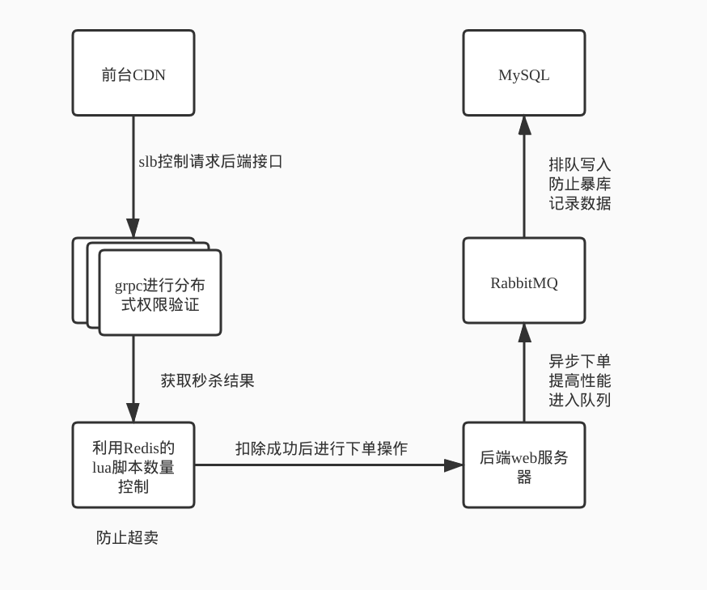

# seckilling-practice-project

这是一个简单个人练手的秒杀项目，记录下各个环节相关要点和对应代码配置。

## 基本架构

## 已经解决问题：

相关详细解决方案：

[解决思路](./relevant.md)

| Problem                                          |
| ------------------------------------------------ |
| 如何解决卖超问题                                 |
| 如何对本项目进行jmeter压测                       |
| 订单处理队列rabbitmq                             |
| 解决分布式身份验证方式                           |
| 秒杀安全 -- 安全性设计                           |
| 通用缓存key的封装采用什么设计模式                |
| redis的库存如何与数据库的库存保持一致            |
| 为什么redis数量会减少为负数                      |
| rabbitmq如何做到消息不重复不丢失即使服务器重启   |
| Nginx优化（前端缓存）                            |
| 分布式事物解决方案（已更新 -- 最新的思路和写法） |
| mysql主从复制思路及实操（未更新代码）            |
| 如何进行分库分表                                 |
| 秒杀类似场景sql的写法注意事项有哪些？            |
| 网站访问统计实现？                               |

### 相关目录：

`redis`：redis的docker化配置和维持高可用相关要点

`rabbitmq`：RabbitMQ配置和持久化相关的要点记录

`jmeter`：jmeter相关文档和要点

`mysql`：MySQL在秒杀环境下主从配置的相关知识和docke化的配置

`backend`：网站商品管理端（gin实现）

`frontend`：网站用户注册和生成cdn静态页面相关（gin实现）

`grpc`：因为利用分布式的来实现哈希一致性，所以利用grpc来在集群中通信

`keys`:全站包括grpc相互调用开启https。这边是相关的key。

`cmd`:分布式服务相关代码，生产测试数据相关代码。

